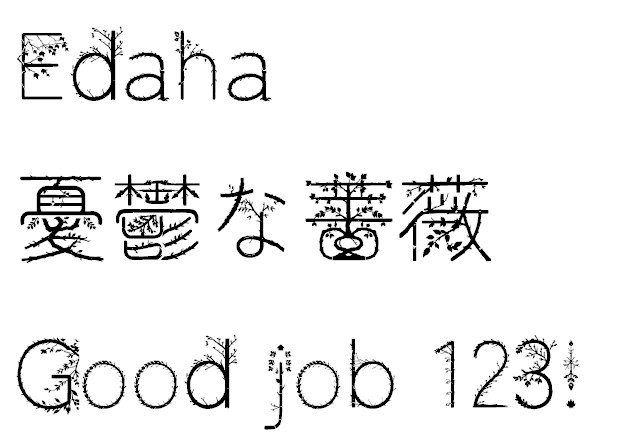

# Edaha (枝葉)

[English follows Japanese]

`Edaha` は、画像生成AIを用いた自作のフォント改変ツール「Font Foundry」によって改変・生成された日本語フォントです。
現在開発中の未完成（WIP: Work In Progress）のプロジェクトであり、仕様や文字のデザインは予告なく変更される場合があります。

## 特徴
- **ベースフォント**: 大平善道氏デザインの「Zen Maru Gothic（ゼン丸ゴシック）」をベースにしています。
- **改変手法**: 自作のフォント改変アプリケーション「Font Foundry」（未公開）を使用し、画像生成AIの技術を組み合わせて独自のニュアンスを加えています。

## クレジットと感謝
このフォントは、以下の素晴らしいオープンソースフォントをベースにして作成されました。

*   **ベースフォント**: Zen Maru Gothic (ゼン丸ゴシック)
*   **製作者**: 大平善道 (Yoshimichi Ohira)
*   **リポジトリ**: [googlefonts/zen-marugothic](https://github.com/googlefonts/zen-marugothic)

ベースフォントの製作者である大平善道氏、および Zen Maru Gothic プロジェクトのすべての貢献者の方々に、心より感謝と敬意を表します。素晴らしいフォントをオープンソースとして公開してくださり、本当にありがとうございます。

## ライセンス
このフォントは **SIL Open Font License 1.1 (OFL-1.1)** のもとで公開されています。詳細なライセンス条項については、同封の `OFL.txt` をご確認ください。

---

# Edaha

`Edaha` is a Japanese font modified and generated using "Font Foundry," a custom font modification tool powered by generative AI.
Please note that this is an unfinished Work In Progress (WIP) project. Specifications and character designs are subject to change.

## Features
- **Base Font**: Based on "Zen Maru Gothic" designed by Yoshimichi Ohira.
- **Modification Method**: Modified using our private custom tool "Font Foundry", integrating generative AI technology to apply unique styles.

## Credits & Acknowledgements
This font was built upon the following wonderful open-source font:

*   **Base Font**: Zen Maru Gothic
*   **Creator**: Yoshimichi Ohira
*   **Repository**: [googlefonts/zen-marugothic](https://github.com/googlefonts/zen-marugothic)

We would like to express our deepest gratitude and respect to Yoshimichi Ohira, the creator of the base font, and all the contributors to the Zen Maru Gothic project. Thank you so much for releasing such an amazing font to the open-source community.

## License
This font is distributed under the **SIL Open Font License 1.1 (OFL-1.1)**. For details, please refer to the accompanying `OFL.txt` file.
